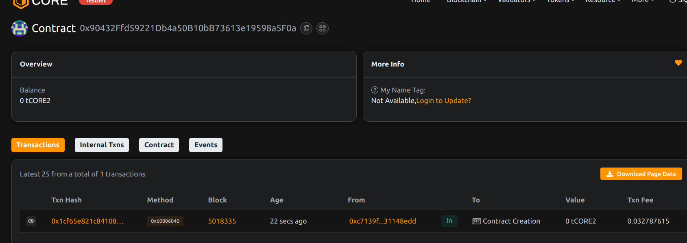

# Project Title: BondChain: Smart Prenup & Partnership Contracts

## Project Description

BondChain is a decentralized platform to create, store, and manage smart prenup and partnership contracts on-chain. It enables transparent, immutable partnership agreements with off-chain terms verifiable via hashes.

## Project Vision

To modernize and secure personal and business partnerships by leveraging blockchain for transparent and tamper-proof contract management.

## Key Features

- Create mutual prenup or partnership agreements
- Store IPFS/off-chain hash of contract terms
- Partners can terminate agreements mutually
- On-chain immutable record and history

## Future Scope

- Integrate arbitration/dispute resolution layers
- Support multi-party partnerships
- Payment and asset escrow linked to agreements
- DAO-managed partnership governance

## Contract Details
0x90432Ffd59221Db4a50B10bB73613e19598a5F0a
 
